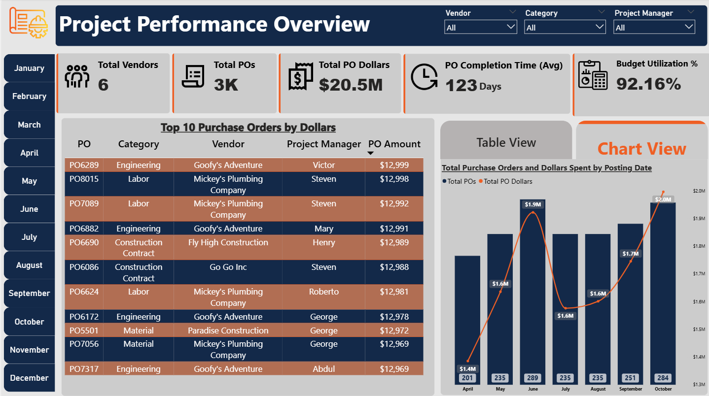
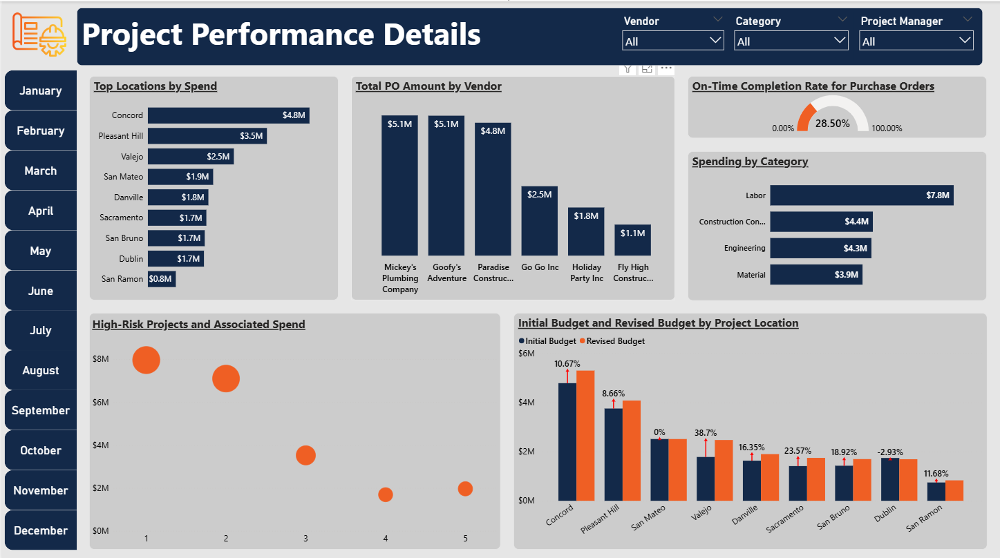
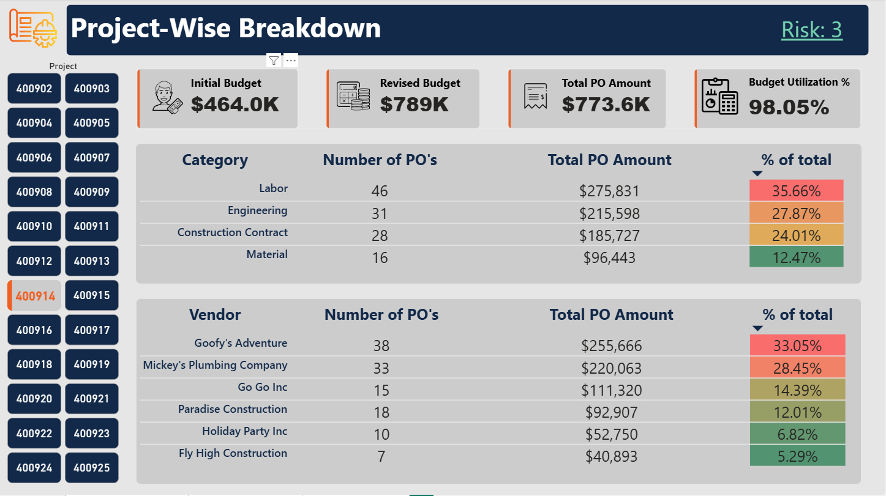
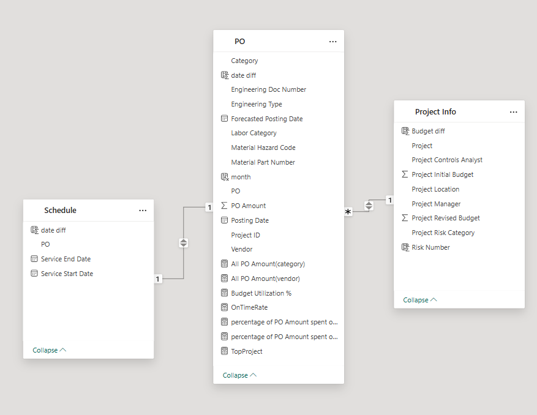

# Project-Performance-Management-Analytics

A comprehensive Power BI solution for analyzing purchase orders (POs), spending, and budget performance across multiple projects and locations—leveraging interactive bookmarks, field parameters, and detailed visualizations to drive strategic decisions.

## 🚩 Problem Statement  
Provide insights into vendor performance, budget utilization, PO completion efficiency, and project risk correlations to optimize resource allocation and mitigate project risk.

## 📊 Dashboard Previews  

### Overview  
Summary metrics for total vendors, total POs, total PO dollars, average PO completion time, and budget utilization percentage.  
  

### Details  
Toggle between Table View and Chart View to explore:  
- **Table View**: Top 10 POs by dollars, including PO ID, category, vendor, project manager, and amount.  
- **Chart View**: Combined column (PO count) and line (PO dollars) by posting date with inline data labels.  
  

### Project-Wise Breakdown  
Interactive selection of individual projects via bookmarks displays:  
- **Initial vs. Revised Budget**: Side-by-side columns with variance % arrows.  
- **Total PO Amount** and **Budget Utilization %** KPIs.  
- **Category Breakdown**: Table of PO counts and spend by category, conditional-formatted by % of total.  
- **Vendor Breakdown**: Table of PO counts and spend by vendor, heat-colored by % of total.  
  

## 📦 Data Model  
The model integrates three fact tables and lookup tables, unified by a central MeasuresTable with year and project keys, supporting dynamic filtering and drill-through.  

**Core Tables & Relationships**  
- **Project Info** ↔ **PO** (1:many on Project ID) ↔ **Schedule** (1:many on PO)  
- **PO[Posting Date]** & **Schedule[Service Start/End Dates]** ↔ **Date[Date]**  
- All fact tables ↔ **MeasuresTable** (1:many on Year & Project)  
 

## 🗂️ Dataset Overview  
The attached Excel reside in `Dataset/` with the following sheet in it:

**Project Info**  
- Project  
- Project Location  
- Project Manager  
- Project Controls Analyst  
- Project Initial Budget (USD)  
- Project Revised Budget (USD)  
- Project Risk Category  

**PO**  
- PO  
- Vendor  
- Category (Engineering, Labor, Construction Contract, Material)  
- Forecasted Posting Date  
- Posting Date  
- PO Amount (USD)  
- Material Part Number & Hazard Code  
- Engineering Doc Number & Type  
- Labor Category  

**Schedule**  
- PO  
- Service Start Date  
- Service End Date  

## 🎯 KPIs & Metrics  
- Total Vendors & Total POs  
- Total PO Dollars  
- Average PO Completion Time (Days)  
- On-Time Completion Rate %  
- Budget Utilization % (∑PO Amount ÷ Revised Budget)  
- Initial vs. Revised Budget Variance %  
- Top 10 POs by Amount  
- Monthly PO Count & Spend Trends  
- Spend by Category & Vendor Shares  

## ✨ Dashboard Features  

### Interactive Bookmarks  
- **Project Selection**: Buttons for each Project ID load that project’s breakdown.  
- **View Toggle**: Ctrl + Click Table/Chart buttons on Details page.

### Field Parameters  
Dynamic slicers toggle between metrics (e.g., PO Count vs. PO Amount) and date grains. For implementation, see Microsoft Power BI “Field parameters”:  
https://learn.microsoft.com/en-us/power-bi/create-reports/power-bi-field-parameters  

### Slicers & Filters  
- Top-right slicers: Vendor, Category, Project Manager  
- Side slicer: Month selection for time-period analysis  

### Visual Explanations  

**Top Locations by Spend**  
A horizontal bar chart ranking project locations by total spend, with data labels in millions to highlight top sites.

**Total PO Amount by Vendor**  
A vertical bar chart sorted descending, showing top vendors’ spend volumes.

**On-Time Completion Rate (Gauge)**  
A gauge visual illustrating the percentage of POs completed by or before their forecasted date.

**Spending by Category**  
A bar chart comparing spend across categories (Engineering, Labor, Construction Contract, Material).

**Scatter Plot (Project Risk vs. Spend)**  
X-axis: Project Risk Category  
Y-axis: Total PO Amount  
Bubble size: Number of POs, revealing risk-spend relationships.

**Initial vs. Revised Budget (Column Chart)**  
Side-by-side columns per location, annotated with variance % arrows indicating budget overruns or underruns.

**Monthly Trends (Combo Chart)**  
Columns: PO count per month  
Line: PO dollars  
Inline data labels show both count and dollar values for each month.

## 🛠️ Tech Stack  
- **Power BI Desktop** for modeling & visualization  
- **DAX** for measures and dynamic parameters  
- **xlsx** raw data in `Dataset/`  
- **Bookmarks & Field Parameters** (enable under File → Options → Preview Features)  

## 🚀 How to Use  
1. Clone the repository.  
2. Place `projectdata.xlsx` in `Dataset/`.  
3. Open `PBIX/Project_Performance_Management.pbix` in Power BI Desktop.  
4. Ensure **Bookmarks** and **Field Parameters** are enabled.  
5. Refresh data.  
6. Use slicers, bookmarks, and parameter controls to explore insights by project, vendor, or time period.

## icons

<a href="https://www.flaticon.com/free-icons/project-management" title="project management icons">Project management icons created by Stockes Design - Flaticon</a>

## 📜 License  
MIT License. See [LICENSE](LICENSE) for details. 

